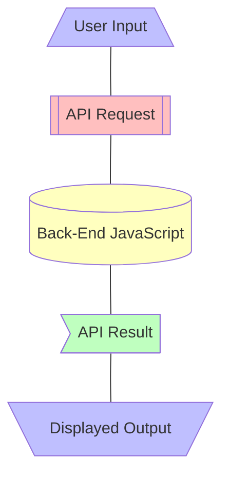
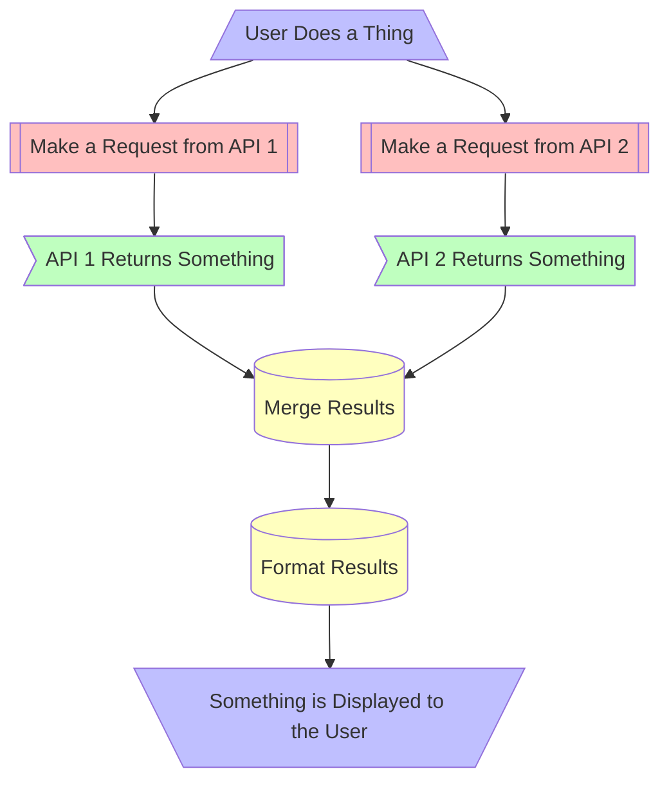
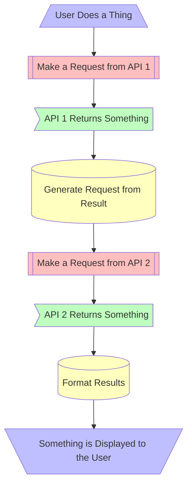
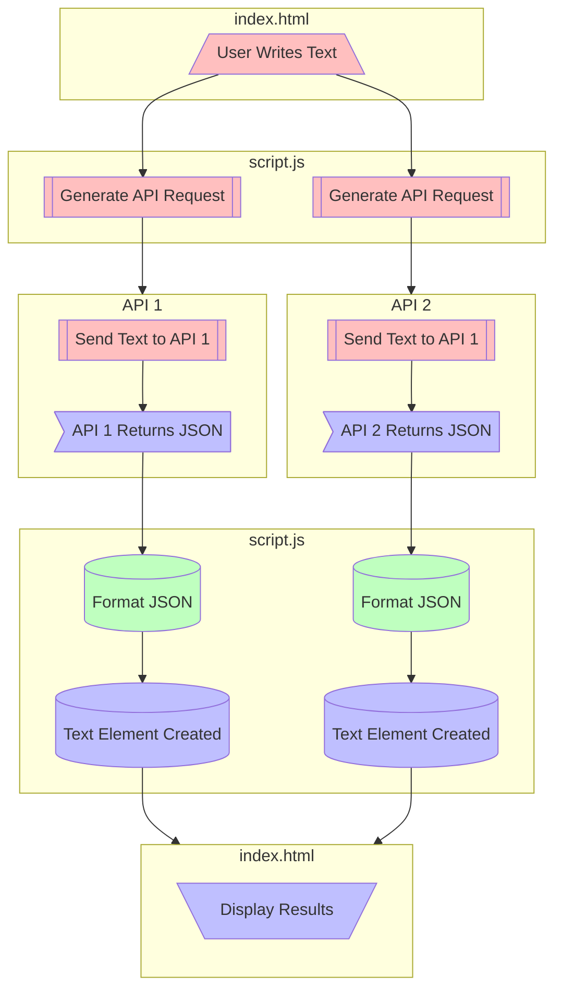

# The Chronolecticon

## Table of Contents
- [Introduction](#introduction)
- [Technologies](#technologies)
- [Installation](#installation)
- [User Journey](#user-journey)
- [HTML Structure](#html-structure)
- [CSS Styling](#css-styling)
- [JavaScript Functionality](#javascript-functionality)
- [Testing](#testing)
- [API Sources](#api-sources)

---

## Introduction

**The Chronolecticon** is a web application designed to provide a fun and unique linguistic experience. It allows discerning professionals and language enthusiasts to translate text from one "serious" language to another. Whether you want to turn your modern English text into Old English, Pig Latin, Mandalorian, Shakespearean English, or Pirate-speak, The Chronolecticon has you covered.

---

## Technologies

 
 
 
 

---

## Installation

To use The Chronolecticon, follow these installation instructions:

1. **Clone the Repository:**
   - Clone this repository to your local machine using the following command:
     ```
     git clone https://github.com/your-username/chronolecticon.git
     ```

2. **Navigate to the Directory:**
   - Change your working directory to the cloned repository:
     ```
     cd chronolecticon
     ```

3. **Open in a Browser:**
   - Open the `index.html` file in your preferred web browser.
   - The application should load and be ready for use.
  
---

## User Journey

1. **Open the Application**
   - Visit the web page in your browser.

2. **Input Your Text**
   - In the "Rustic Verbiage" section, select two languages from the dropdown menus for "Serious Language One" and "Serious Language Two."
   - Enter the text you want to translate in the "Untranslated Text" input field.

3. **Initiate Translation**
   - Click the "Translate!" button.

4. **View Translations**
   - Two translations will appear in the "Refined Parlance" section:
     - "Translation One" in the left box.
     - "Translation Two" in the right box.

5. **Explore Translations**
   - Enjoy exploring the translated versions of your text in different "serious" languages.

6. **Repeat or Reset**
   - You can repeat the translation process with different text or languages by entering new input and clicking "Translate!" again.

---

## HTML Structure

The HTML file (`index.html`) is structured as follows:

- It consists of a `<head>` section with metadata and links to external resources like stylesheets and scripts.
- The `<body>` contains the main content of the application, divided into three sections: `header`, `main`, and `footer`.
- In the `main` section, there are two subsections: `input` and `output`. The `input` section contains the form for language selection and text input. The `output` section displays the translated text.
- The form allows users to select the source and target languages and provides an input field for the text to be translated.
- The translations appear in two separate boxes with "Translation One" and "Translation Two" headers.

---

## CSS Styling

The CSS file (`style.css`) defines the styling of the application. It uses CSS variables to manage colors, borders, and layout. Key CSS classes and styles include:

- Border styles and colors for various elements.
- Text alignment for centering or right-aligning content.
- Font families and sizes for headings and text.
- Flexbox layout classes for parent-child relationships.
- Placeholder label animations for the text input field.
- Styling for loading messages.

---

## JavaScript Functionality

The JavaScript file (`script.js`) provides the functionality for the application. Key features include:

- Retrieving user input for the source and target languages and the text to be translated.
- Making API requests to Funtranslations for language translation.
- Displaying the translations in the designated output boxes.
- Handling errors and displaying error messages.
- Using event listeners to trigger translation on form submission.

---

## Testing

It appears that there is a testbed section in the JavaScript code, but it is currently commented out. You can use this section to test the functionality of the application by calling the `pullFromAPI` and `pushToPage` functions with different languages and text.

---

## API Sources

The application uses the Funtranslations API to perform language translations. It constructs URLs based on the selected languages and user input and fetches translated content from the API.

---

Enjoy exploring the diverse linguistic possibilities that The Chronolecticon offers! If you encounter any issues or have suggestions for improvement, please feel free to contribute to the development of this linguistic tool.

---

## Jason and Phoebe's Extended Thought Sandpit

Text go in, other text go out

## Features

- Translate text into various other semi-legitimate sociolects 


## README Checklist

> Courtesy of [DDBeck](https://github.com/ddbeck/readme-checklist)

### Help the reader identify the project 

- [x] Name the file
- [x] At the top of the file, **make sure the project's name is the first heading or plain text**. 
- [ ] Under the project name or linked from it, add a URL for the project (such as repository or homepage URL). 
- [ ] Under the project name, clearly identify the owner or author of the project (e.g., "By Author McAuthorface" or "Copyright Owner Name 2018"). 

### Help the reader evaluate the project 

- [ ] Describe the project in terms of what the project does or achieves, not what it's made out of.
  - Focus on why not what.
  - If the project is new or doesn't have an intended use, tell an origin story instead:
    - `One day I was _____.`
    - `I tried to _____ but _____.`
    - `Instead, I made <PROJECT NAME> to _____.`
    - Or you can try inverting the description, describing what your project is *not* good for.
  - Other Tips
    - Write to your reader in the second person (you) 
    - Use action verbs and avoid the passive voice (e.g., write `<PROJECT NAME> creates files` instead of `Files are created by <PROJECT NAME>`)
    - Avoid the verbs *to be*, *to have*, and (sometimes) *to get*
    - Avoid acronyms and initialisms 
  - Warning
    - You may be tempted to describe how the project is made— what languages, technologies, and tools—instead of what the project does.
    - That's sometimes useful information, but save it until after you've described how the project is supposed to help the reader. 
- [ ] Describe who may use the project and under what terms.
  - Open-source projects
    - Describe then name the license.
  - Closed-source projects
    - Describe who may use and distribute the project.
    - For publicly available projects, you may reference an EULA or other licensing document.
    - For private or internal projects, you may want to explicitly allow or deny public disclosure of the project.

### Help the reader use the project 

- [ ] If applicable, **list the project's prerequisites**. 
  - Your project may require things that are out of the scope of ordinary installation or usage instructions.
  - List these requirements before or at the beginning of such instructions.
- [ ] List the steps to install and use the project one time.
  - Help the reader go from having your project's files to using the project for the first time.
  - For a programming language, this might be installation followed by running a "hello world" program.
  - For a documentation project this might be building the site and opening the homepage in a web browser.
  - For a README-only project, this might be a preface or introduction.
  - No matter how your project runs, however, stop once the project works once. Extended usage instructions belong in dedicated documentation files, not your README. 
- [ ] Test your install and setup steps.
  - There's nothing to write down for this, but be sure what you've already written actually works. 

### Help the reader engage with the project 

- [ ] Tell your audience where to go for more project documentation.
  - Describe any additional documentation and where to find it.
  - This may include your project's: 
    - Website 
    - Documentation files 
    - Man page 
    - Help command(s) 
    - Top-level README companion files, such as:
      - `LICENSE`
      - `CONTRIBUTING`
      - `CODE_OF_CONDUCT`
      - `AUTHORS`
      - `CHANGELOG`
      - `BUGS` 
  - It's not enough to link to documents; briefly describe them too. 
- [ ] Tell your audience where to go for help.
  - This may include descriptions and links to mailing lists, issue trackers, forums, email addresses, or other support avenues (like Stack Overflow tags).
  - If the project is unsupported or support is only available for a fee, now would be a good time to mention that. 
- [ ] **Tell your audience how to help.** 
  - *Open-source projects*
    - Link to and summarize the project's contributor's guide, if one exists, or describe how and where you want contributors to add to your project (e.g., via GitHub pull requests or patches mailed to a specific address).
  - *Closed-source projects*
    - describe how and where bugs should be reported. 

### Final checks

- [ ] **If your README is long, add a table of contents** after your project description.
  - If your README is more than three or four screens long, make it easier to skim by adding a table of contents.
  - A list of section headings is enough.
- [ ] **If your README is very long, move content to other documents.** 
  - If your README is more than ten or twelve screens long, move stuff into separate documents.
  - Keep your README file short, or readers may become overwhelmed.
  - A comprehensive README is a bad README. 
- [ ] **Set a reminder to review your README and this checklist in a few weeks**.
- [ ] **Tell [ddbeck](https://github.com/ddbeck/) that you used this checklist.**
  - You can tweet at him or open an issue on ddbeck/readme-checklist.

---

## Jason's Think Hole

### Usage Diagrams

#### Key



#### Initial Idea 1: Simultaneous



#### Initial Idea 2: Sequential




---

#### Current Idea



---

#### Input & Output

##### Input

> What Does the User Do?

- Press a button?
- Type a value that is sent to one API?
- Type a value that is sent to all APIs?
- Chooses a value from a list given by an API?

##### Output

> What does the app spit out?

- Relationship Between Data
- Display Format

---

### Theme Ideas

#### Ideas I Like

> Me Likey

- **Mythos**
- Which god you should worship based on your values/ethical beliefs
- **Language Bastards** _(Government Edition)_
- Correlations between...
	- minority first language speakers
	- socioeconomic outcomes
		- national/regional policies towards those languages
- **Language Bastards** _(Individual Edition)_
- Attitudes of people speaking a particular language towards speakers of other languages correlated with degree of relatedness between those languages
- Catalan, Castilian, Occitan, French & Basque would be a great test case
- **Dogwhistle Tracker**
- Last time a newspaper printed a given slur word without quotation marks.
- Maybe correlated with attitudes towards current social issues?
- **Historical Event Lifetime Extrapolator**
- Pick a historical event.
- Imagine an unnamed participant in that event.
- Define how old they were at the time
- App displays what other events they experienced in their lifetime
- **Word Expander**
- Apply pre-existing affixes to any word in order to convey new meaning
- Possibly separately input desired extra meaning not conveyed by root word
- Possibly can weight likelihood of older or newer affixes to convey sense of when word was coined
- e.g. adjectival form of politician, add connotation of "fool", skew towards Middle English affixes

#### Meh

> Ideas That Are... Fine?

- **Creative Insult Idomiser**
- Enter how you want to insult someone.
- Return an idiom translated from another language
- **Hometown Heritage**
- Who was the first recorded named person from your town
- Something to do with MBTI personality typology?
- **Pseudoscience Discoverer**
- Dodgiest research papers on a subject of your choice
- **North-South Hemisphere Holiday Translator**
- **Crap Pseudo-Science Aggregator**
- **Politician Dewaffler**
- **Podcast Discoverer**
- **Wat iz a Vaporwave?**
- Venn Diagram Generator of Obscure Musical Subgenres
- **Family Term Attitude Extrapolator**
- Kinship terms within a language correlated with expressed attitudes towards social norms
- Could go a little bit too Sapir-Whorf
- [Genderize](https://genderize.io/), [Nationalize](https://nationalize.io/) & [Agify](https://agify.io/) predict someone's gender, nationality & gender based on their name.
- We could serve someone the most polar opposite name possible...
- Or the most average name someone of their demographic could have?

#### WTF?

> Ideas I Should Never Have Thought Up

- ~~Quotes from religious texts to help you justify horrible shit you want to do~~ This seemed funny until fucking horror erupted
- Could Genghis Khan beat up a shark?
- Analyse the emotional tone & sentiment of text, but the analysis is really judgemental
- **Weird Shit Your Country Believes**

#### FFS

> This Isn't an Idea Jason, It's Just a Funny Sentence You Thought Of

- **Right Wing Catastrophism Analyser**
- **Awful Hot Take Generator**
- **Uncomfortable Recommendations**

---

### Interesting APIs

#### Utility

##### Generic

> APIs to Plug Into Other Ideas

- [ColorMind](http://colormind.io/api-access/): Colour Palette Generation & Editing
- [Deck of Cards](https://deckofcardsapi.com/)

##### Formatting

> APIs That Format Other Data

- [GitHub Contributions Chart Generator](https://github-contributions.vercel.app/)
- [ImageCharts](https://documentation.image-charts.com/): Present data in a variety of chart types
- [Kroki](https://kroki.io/): Generates diagrams from textual descriptions

---

#### Content
##### Actual Data

- [Teleport](https://developers.teleport.org/api/): Quality of Life Data
- [UK Police Data](https://data.police.uk/docs/)
- [Urban Observatory](https://newcastle.urbanobservatory.ac.uk/): UK Urban Data
- [Wikipedia](https://www.mediawiki.org/wiki/API)

##### Niche

- [BoardGameGeek](https://boardgamegeek.com/wiki/page/BGG_XML_API2?ref=apislist.com)
- [Cognosaurus](https://github.com/JohnLapis/cognosaurus): Find cognates
- [Dog API](https://dog.ceo/dog-api/)
- [Groundhogs](https://groundhog-day.com/?ref=apislist.com)
- [Morpheus](https://github.com/morpheusgraphql/mythology-api): Greek Mythology
- [PoetryDB](https://github.com/thundercomb/poetrydb)
- [Traitify](https://app.traitify.com/developer): Personality Tests

##### Silly

> Generators & the Like

- [Binary Jazz](https://binaryjazz.us/genrenator-api/): Music Genre Generator
- [Bored](https://www.boredapi.com/): Random Activities
- [Corporate Bullshit Generator](https://github.com/sameerkumar18/corporate-bs-generator-api)
- [RPS-101](https://rps101.pythonanywhere.com/api?ref=apislist.com): Rock, Paper, Scissors with 101 Objects

---

### Arguments with Bard

#### CSS Help

##### Question

I am building a small web app. I will paste the HTML & JavaScript code into this chat, and I would like you to give me CSS code that I can use to populate the stylesheet.

Please suggest 10 alternative & contrasting approaches with commentary. There should be a variety of layouts between these approaches, and each approach should include at least one technique not used in the other approaches.

##### Answer

Here are 10 alternative and contrasting CSS approaches for your small web app, with commentary:

**Approach 1: Simple flexbox**

```css
html, body {
  margin: 0;
  padding: 0;
  height: 100%;
  display: flex;
  flex-direction: column;
}

#dummyDiv {
  flex: 1;
  display: flex;
  align-items: center;
  justify-content: center;
}

.dummyClass {
  font-size: 24px;
}

.result1Box, .result2Box {
  flex: 1;
  display: flex;
  align-items: center;
  justify-content: center;
}
```

Commentary: This approach uses flexbox to create a simple two-column layout, with the dummy content in the left column and the result boxes in the right column. The result boxes are also flex containers, so the content inside them will be centered both horizontally and vertically.

**Approach 2: Grid layout**

```css
html, body {
  margin: 0;
  padding: 0;
  height: 100%;
  display: grid;
  grid-template-columns: 1fr 2fr;
}

#dummyDiv {
  grid-column: 1 / 3;
  grid-row: 1 / 3;
  display: flex;
  align-items: center;
  justify-content: center;
}

.dummyClass {
  font-size: 24px;
}

.result1Box, .result2Box {
  grid-column: 2 / 3;
  grid-row: 1 / 2;
  display: flex;
  align-items: center;
  justify-content: center;
}
```

Commentary: This approach uses grid layout to create the same two-column layout as the previous approach, but it is a bit more flexible. For example, you could easily add a third column or change the order of the columns.

**Approach 3: CSS variables**

```css
:root {
  --dummy-font-size: 24px;
  --result-box-height: 100px;
}

html, body {
  margin: 0;
  padding: 0;
  height: 100%;
  display: flex;
  flex-direction: column;
}

#dummyDiv {
  flex: 1;
  display: flex;
  align-items: center;
  justify-content: center;
}

.dummyClass {
  font-size: var(--dummy-font-size);
}

.result1Box, .result2Box {
  flex: 1;
  height: var(--result-box-height);
  display: flex;
  align-items: center;
  justify-content: center;
}
```

Commentary: This approach uses CSS variables to define the font size and height of the dummy content and result boxes. This makes it easy to change these values throughout your CSS without having to search for them and replace them all.

**Approach 4: CSS preprocessors**

```css
/* Sass */

$dummy-font-size: 24px;
$result-box-height: 100px;

html, body {
  margin: 0;
  padding: 0;
  height: 100%;
  display: flex;
  flex-direction: column;
}

#dummyDiv {
  flex: 1;
  display: flex;
  align-items: center;
  justify-content: center;
}

.dummyClass {
  font-size: $dummy-font-size;
}

.result1Box, .result2Box {
  flex: 1;
  height: $result-box-height;
  display: flex;
  align-items: center;
  justify-content: center;
}
```

Commentary: CSS preprocessors like Sass and LESS allow you to use variables, mixins, and other features to make your CSS more organized and maintainable. This
