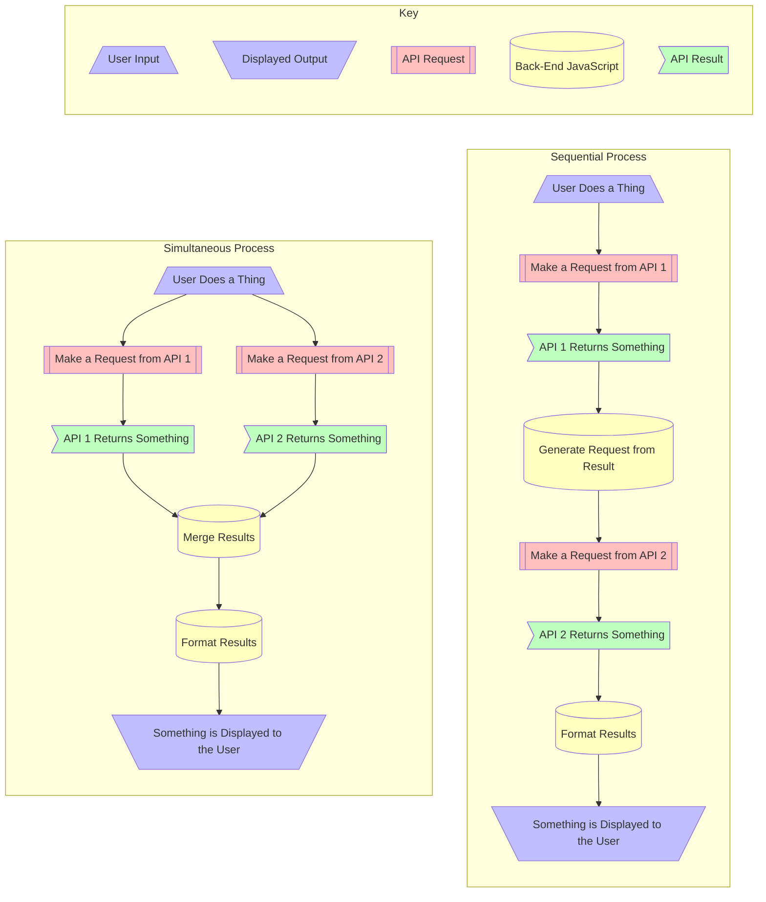

# Very Sensible Unspecified App

## To Do

- [ ] Decide sensible topic
- [ ] Reject previous idea and choose fun topic
- [ ] Panic
- [ ] Code frantically
- [ ] Profit

---

## Usage & Method

### Possible Processes

#### Input: What Does the User Do?

- Press a button?
- Type a value that is sent to one API?
- Type a value that is sent to all APIs?
- Chooses a value from a list given by an API?

#### Output: What does the app spit out?

- Relationship Between Data
- Display Format

---

## Jason's Think Hole

### Theme Ideas

#### Ideas I Like

- **Mythos**
	- Which god you should worship based on your values/ethical beliefs
- **Language Bastards** _(Government Edition)_
	- Correlations between...
 		- minority first language speakers
   		- socioeconomic outcomes
     		- national/regional policies towards those languages
- **Language Bastards** _(Individual Edition)_
	- Attitudes of people speaking a particular language towards speakers of other languages correlated with degree of relatedness between those languages
	- Catalan, Castilian, Occitan, French & Basque would be a great test case
- **Dogwhistle Tracker**
	- Last time a newspaper printed a given slur word without quotation marks.
	- Maybe correlated with attitudes towards current social issues?
- **Historical Event Lifetime Extrapolator**
	- Pick a historical event.
	- Imagine an unnamed participant in that event.
	- Define how old they were at the time
	- App displays what other events they experienced in their lifetime
- **Word Expander**
	- Apply pre-existing affixes to any word in order to convey new meaning
	- Possibly separately input desired extra meaning not conveyed by root word
	- Possibly can weight likelihood of older or newer affixes to convey sense of when word was coined
	- e.g. adjectival form of politician, add connotation of "fool", skew towards Middle English affixes

#### Ideas That Are... Fine?

- Creative Insult Idomiser
	- Enter how you want to insult someone. Return an idiom translated from another language
- Hometown Heritage
	- Who was the first recorded named person from your town
- Something to do with MBTI personality typology?
- Pseudoscience Discoverer
	- Dodgiest research papers on a subject of your choice
- North-South Hemisphere Holiday Translator
- Crap Pseudo-Science Aggregator
- Politician Dewaffler
- Podcast Discoverer
- Wat iz a Vaporwave?
	- Venn Diagram Generator of Obscure Musical Subgenres
- Family Term Attitude Extrapolator
	- Kinship terms within a language correlated with expressed attitudes towards social norms
	- Could go a little bit too Sapir-Whorf

### Tolerable Ideas With APIs Researcher

- [Genderize](https://genderize.io/), [Nationalize](https://nationalize.io/) & [Agify](https://agify.io/) predict someone's gender, nationality & gender based on their name.
	- We could serve someone the most polar opposite name possible...
	- Or the most average name someone of their demographic could have?

#### Ideas I Should Never Have Thought Up

- Quotes from religious texts to help you justify horrible shit you want to do
- Could Genghis Khan beat up a shark?
- Analyse the emotional tone & sentiment of text, but the analysis is really judgemental
- Weird Shit Your Country Believes

#### This Isn't an Idea Jason, It's Just a Funny Sentence You Thought Of

- Right Wing Catastrophism Analyser
- Awful Hot Take Generator
- Uncomfortable Recommendations

---

### Interesting APIs

#### Generic APIs to Plug Into Other Ideas

- [ColorMind](http://colormind.io/api-access/): Colour Palette Generation & Editing
- [Deck of Cards](https://deckofcardsapi.com/)

#### Actual Data

- [Teleport](https://developers.teleport.org/api/): Quality of Life Data
- [UK Police Data](https://data.police.uk/docs/)
- [Urban Observatory](https://newcastle.urbanobservatory.ac.uk/): UK Urban Data
- [Wikipedia](https://www.mediawiki.org/wiki/API)

#### Niche Stuff

- [BoardGameGeek](https://boardgamegeek.com/wiki/page/BGG_XML_API2?ref=apislist.com)
- [Cognosaurus](https://github.com/JohnLapis/cognosaurus): Find cognates
- [Dog API](https://dog.ceo/dog-api/)
- [Groundhogs](https://groundhog-day.com/?ref=apislist.com)
- [Morpheus](https://github.com/morpheusgraphql/mythology-api): Greek Mythology
- [PoetryDB](https://github.com/thundercomb/poetrydb)
- [Traitify](https://app.traitify.com/developer): Personality Tests

#### Silly Generators & the Like

- [Binary Jazz](https://binaryjazz.us/genrenator-api/): Music Genre Generator
- [Bored](https://www.boredapi.com/): Random Activities
- [Corporate Bullshit Generator](https://github.com/sameerkumar18/corporate-bs-generator-api)
- [RPS-101](https://rps101.pythonanywhere.com/api?ref=apislist.com): Rock, Paper, Scissors with 101 Objects

#### APIs That Format Other Data

- [GitHub Contributions Chart Generator](https://github-contributions.vercel.app/)
- [ImageCharts](https://documentation.image-charts.com/): Present data in a variety of chart types
- [Kroki](https://kroki.io/): Generates diagrams from textual descriptions

---
